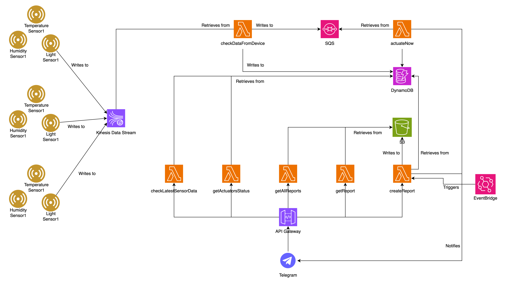

# Intro
SmartGarden is a simple project to simulate a - surprise! - smart pots system capable of self-maintenance. It has been developed during the Serverless Computing for IoT course in the Computer Science Master's Degree pathway @ UNISA.

# Architecture

The architecture consists of several services working independently but in sync to let the system work as a whole. In the setting presented here, the system is composed of 3 pots and ideally each pot contains a single species of plant. Each pot has 3 sensors: huimdity, light and temperature. First, the sensors send data to a Kinesis stream, capable of quickly managing them. Theoretically, sensors could be programmed to send hundreds of readings in a bunch of seconds. The Kinesis stream then send them to a Lambda that checks the readings for each pot and for each sensor type against constant thresholds. As soon as data are checked, they are published on the DynamoDB table. In this way, in every moment the table contains the latest and most up-to-date informations about the system state. Furthermore, if one of these thresholds is excedeed, the system needs to react in order to preserve the good health of the plants. Each pot has 2 actuators that can be manipulated: a cover and an irrigator. The cover is used to act on temperature and light levels, while the irrigator is used to act on the humitidy level. To trigger one of these actuators, a message on a SQS queue is published. When this happens, another Lambda (actuateNow) reads the message and act on the appropriate actuator of the appropriate pot. It then updates the state of the pot on the DynamoDB table. As the end-user can trigger an actuator on its own using the Telegram Bot, if that's not the case and the actuator has been triggered autonomously by the system itself a message is sent to the end-user through Telegram to let him know an actuator has been used. An EventBridge rule has been implemented to produce a complete report about the system state every day at 10:00 AM. The report is then uploaded to the S3 bucket and the end-user is noticed about its creation and asked if he wants to download it. Again, if the user himself asks to produce a report through Telegram, the message is not sent. The end-user can also ask about the latest sensors readings, the actuator status and all the reports ever created through the bot. The bridge between the bot and the Lambdas exposing these services is implemented through the API Gateway service.

The Serverless architecture proposed gives the project advangtes and perfectly matches with its nature. 
As SmartGarden is basically founded on an Event-Driven architecture in the cloud, it is highly scalable (our amateur end-user suddenly becomes the official basil supplier of the best pizzeria in the counrty) but above all it is reliable and robust. In the event that some services don't work, the system as a whole will continue going on (i.e. user could be unable to download reports for some reason, but the sensor data monitoring will continue to work and thus the system will continue to automatically react to external conditions to keep its good health). Also, it is easily improvable adding Lambda functions to add new features. Finally, in the eventuality the end-user wants to deploy the project online, the use of AWS will make it pretty cheap and affordable, while guaranteeing a safe and trustworthy backend.


# Amazon Web Services used
- [Lambda](https://aws.amazon.com/lambda/)
- [DynamoDB](https://aws.amazon.com/dynamodb/)
- [S3](https://aws.amazon.com/s3/)
- [Kinesis](https://aws.amazon.com/kinesis/data-streams/)
- [SQS](https://aws.amazon.com/sqs/)
- [API Gateway](https://aws.amazon.com/api-gateway/)
- [EventBridge](https://aws.amazon.com/eventbridge/)

# Installation
## Requirements
The following apps / libraries / packages are needed to successfully build and run the project:
- [Docker](https://www.docker.com/)
- [Localstack](https://www.localstack.cloud/)
- [Python](https://www.python.org/)
- [pyTelegramBotAPI](https://github.com/eternnoir/pyTelegramBotAPI)
- [python-dotenv](https://github.com/theskumar/python-dotenv)
- [JQ](https://jqlang.github.io/jq/)

## Setting up the environment
- Clone the repo.
    ```bash
    git clone https://github.com/YantCaccia/SmartGarden
    cd SmartGarden
    ```

- Create a Telegram BOT using [bot-father](https://telegram.me/BotFather).

- Create a `.env` file in the project root folder.

- Put the Telegram Bot Token and the Telegram Chat ID in the .env file.
    ```
    TELEGRAM_BOT_TOKEN=XXX
    TELEGRAM_CHAT_ID=XXX
    ```

- Source the .env to make the 2 just-declared variables available to the current environment.
    ```bash
    source .env
    ```

- Install the dependencies for the Telegram Bot.
    ```bash
    pip install -r ./bot/requirements.txt
    ```

- Start the Localstack Docker image.
    ```bash
    docker-compose up
    ```

## Automated install
- Launch the script to create all the AWS architecture described above on the local Localstack instance.
    ```bash
    chmod +x ./install.sh
    ./install.sh
    ```
    In addition to create all the required services instances and link them toghether, the script will also make the Telegram Bot Token and Chat ID available to the Lambda functions that require them reading them from the .env file and adding them to the their Environment Variables. Furthermore, it will append to the .env the API Gateway URL right after instantiating it.

## Manual install
- Setup Localstack's ```awslocal``` command.
    ```bash
    alias awslocal="AWS_ACCESS_KEY_ID=test \
                AWS_SECRET_ACCESS_KEY=test \
                AWS_DEFAULT_REGION=${DEFAULT_REGION:-$AWS_DEFAULT_REGION} \
                aws --endpoint-url=http://${LOCALSTACK_HOST:-localhost}:4566"
    ```

- Create S3 bucket.
    ```bash
    awslocal s3api create-bucket \
    --bucket smartgarden-s3-bucket
    ```

- Create DynamoDB table. The Key of the table will be the "PotID" attribute. It will be a String.
    ```bash
    awslocal dynamodb create-table \
    --table-name Pots \
    --attribute-definitions AttributeName=PotID,AttributeType=S \
    --key-schema AttributeName=PotID,KeyType=HASH \
    --provisioned-throughput ReadCapacityUnits=1,WriteCapacityUnits=1 \
    --region $region \
    --no-cli-pager
    ```

- Create the SQS queue. This queue will receive messages from the "checkDataFromDevice" Lambda if some actuator needs to be activated. The queue acts as a link between it and the "actuateNow" Lambda.
    ```bash
    WateringQueueCreationOutput=$(awslocal sqs create-queue --queue-name WateringQueue --region $region)
    
    WateringQueueURL=$(echo "$WateringQueueCreationOutput" | jq -r '.QueueUrl')
    
    WateringQueueARN=$(awslocal sqs get-queue-attributes \
    --queue-url $WateringQueueURL \
    --attribute-name QueueArn | jq -r '.Attributes.QueueArn')
    ```

- Create the Kinesis stream. Sensors' data will be put directly on the this Kinesis stream.
    ```bash
    awslocal kinesis create-stream --stream-name SensorsToLambda --shard-count 1 --region $region
    
    KinesisStreamARN=$(awslocal kinesis describe-stream --stream-name SensorsToLambda --region $region | jq -r '.StreamDescription.StreamARN')
    ```

- Create Role for Lambda and attach Role to Policy.
    ```bash
    Role=$(awslocal iam create-role --role-name 
    LambdaAndKinesisRole --assume-role-policy-document file://./roles/lambda_role.json)
    
    RoleARN=$(echo "$Role" | jq -r '.Role.Arn')

    awslocal iam attach-role-policy --role-name LambdaAndKinesisRole --policy-arn arn:aws:iam::aws:policy/service-role/AWSLambdaKinesisExecutionRole
    ```

- Zip, create and attach the right event-source mapping to the right lambdas. 
Lambdas will be briefly described in the next step, apart from che "checkDataFromDevice" one. It will get all the sensors' measurements from the Kinesis stream and check them against predetermined thresholds. If one of these thresholds are exceeded, it will send a message to the SQS queue to trigger the activation of the right actuator.  
    ```bash
    mkdir ./tmpZips

    #--- CheckDataFromDevice ---#
    CheckDataFromDeviceFunctionName=checkDataFromDevice

    # Zip src
    zip -j ./tmpZips/$CheckDataFromDeviceFunctionName.zip ./lambdas/$CheckDataFromDeviceFunctionName.py ./lambdas/utilities.py

    # Create lambda
    awslocal lambda create-function --function-name $CheckDataFromDeviceFunctionName \
        --zip-file fileb://./tmpZips/$CheckDataFromDeviceFunctionName.zip \
        --handler $CheckDataFromDeviceFunctionName.lambda_handler \
        --runtime python3.12 \
        --role $RoleARN \
        --no-cli-pager

    # Create Event-Source Mapping for checkDataFromDevice
    awslocal lambda create-event-source-mapping \
        --function-name $CheckDataFromDeviceFunctionName \
        --event-source $KinesisStreamARN \
        --batch-size 5 \
        --starting-position LATEST \
        --no-cli-pager


    #--- ActuateNow ---#
    ActuateNowFunctionName=actuateNow

    # Zip src
    zip -j ./tmpZips/$ActuateNowFunctionName.zip ./lambdas/$ActuateNowFunctionName.py ./lambdas/utilities.py

    # Create lambda
    awslocal lambda create-function --function-name $ActuateNowFunctionName \
        --zip-file fileb://./tmpZips/$ActuateNowFunctionName.zip \
        --handler $ActuateNowFunctionName.lambda_handler \
        --runtime python3.12 \
        --role $RoleARN \
        --environment "Variables={TELEGRAM_BOT_TOKEN=$TELEGRAM_BOT_TOKEN,TELEGRAM_CHAT_ID=$TELEGRAM_CHAT_ID}" \
        --no-cli-pager

    # Create Event-Source Mapping for actuateNow
    awslocal lambda create-event-source-mapping \
        --function-name $ActuateNowFunctionName \
        --event-source $WateringQueueARN \
        --batch-size 5 \
        --starting-position LATEST \
        --no-cli-pager


    #--- GetActuatorsStatus ---#
    GetActuatorsStatusFunctionName=getActuatorsStatus

    # Zip src
    zip -j ./tmpZips/$GetActuatorsStatusFunctionName.zip ./lambdas/$GetActuatorsStatusFunctionName.py ./lambdas/utilities.py

    # Create lambda
    awslocal lambda create-function --function-name $GetActuatorsStatusFunctionName \
        --zip-file fileb://./tmpZips/$GetActuatorsStatusFunctionName.zip \
        --handler $GetActuatorsStatusFunctionName.lambda_handler \
        --runtime python3.12 \
        --role $RoleARN \
        --no-cli-pager


    #--- GetSensorData ---#
    GetSensorDataFunctionName=getLatestSensorData

    # Zip src
    zip -j ./tmpZips/$GetSensorDataFunctionName.zip ./lambdas/$GetSensorDataFunctionName.py ./lambdas/utilities.py

    # Create lambda
    awslocal lambda create-function --function-name $GetSensorDataFunctionName \
        --zip-file fileb://./tmpZips/$GetSensorDataFunctionName.zip \
        --handler $GetSensorDataFunctionName.lambda_handler \
        --runtime python3.12 \
        --role $RoleARN \
        --no-cli-pager


    #--- CreateReport ---#
    CreateReportFunctionName=createReport

    # Zip src
    zip -j ./tmpZips/$CreateReportFunctionName.zip ./lambdas/$CreateReportFunctionName.py ./lambdas/utilities.py

    # Create lambda
    awslocal lambda create-function --function-name $CreateReportFunctionName \
        --zip-file fileb://./tmpZips/$CreateReportFunctionName.zip \
        --handler $CreateReportFunctionName.lambda_handler \
        --runtime python3.12 \
        --role $RoleARN \
        --environment "Variables={TELEGRAM_BOT_TOKEN=$TELEGRAM_BOT_TOKEN,TELEGRAM_CHAT_ID=$TELEGRAM_CHAT_ID}" \
        --no-cli-pager


    #--- DownloadReport ---#
    DownloadReportFunctionName=getReport

    # Zip src
    zip -j ./tmpZips/$DownloadReportFunctionName.zip ./lambdas/$DownloadReportFunctionName.py ./lambdas/utilities.py

    # Create lambda
    awslocal lambda create-function --function-name $DownloadReportFunctionName \
        --zip-file fileb://./tmpZips/$DownloadReportFunctionName.zip \
        --handler $DownloadReportFunctionName.lambda_handler \
        --runtime python3.12 \
        --role $RoleARN \
        --no-cli-pager

    #--- DownloadAllReports ---#
    DownloadAllReportsFunctionName=getAllReports

    # Zip src
    zip -j ./tmpZips/$DownloadAllReportsFunctionName.zip ./lambdas/$DownloadAllReportsFunctionName.py ./lambdas/utilities.py

    # Create lambda
    awslocal lambda create-function --function-name $DownloadAllReportsFunctionName \
        --zip-file fileb://./tmpZips/$DownloadAllReportsFunctionName.zip \
        --handler $DownloadAllReportsFunctionName.lambda_handler \
        --runtime python3.12 \
        --role $RoleARN \
        --no-cli-pager
    

    rm -r ./tmpZips/*
    rm -f ./tmpZips/.DS_Store
    rmdir ./tmpZips
    ```

- Create the EventBridge rule to call the generateReport lambda every day at 10:00AM.
    ```bash
    awslocal events put-rule \
        --name scheduled-generate-report \
        --schedule-expression 'cron(00 10 * * ? *)' \
        --region us-east-1

    awslocal lambda add-permission \
        --function-name $CreateReportFunctionName \
        --statement-id scheduled-generate-report-event \
        --action 'lambda:InvokeFunction' \
        --principal events.amazonaws.com \
        --source-arn arn:aws:events:us-east-1:000000000000:rule/scheduled-generate-report

    awslocal events put-targets \
        --rule scheduled-generate-report \
        --targets file://targets/targets.json \
        --region us-east-1

    ```

- Instantiate the API Gateway.
    ```bash
    output_api1=$(awslocal apigateway create-rest-api --name 'SmartGarden API Gateway' --region us-east-1)
    api_id1=$(echo $output_api1 | jq -r '.id')

    output_parent1=$(awslocal apigateway get-resources --rest-api-id $api_id1 --region us-east-1)
    parent_id1=$(echo $output_parent1 | jq -r '.items[0].id')
    ```

- Create all the required endpoints to let the Bot communicate to the project services. There will be 6 endpoint to trigger the following Lambdas:
    - ActualStatus -> "getLatestSensorData" -> Get the latest data about sensors' readings;
    - LatestActuator -> "getActuatorStatus" -> Get the latest data about actuators operations;
    - ActuateNow -> "actuateNow" -> Trigger an actuator;
    - Create Report -> "createReport" -> Create a complete report of the system and upload it to S3;
    - Download Report -> "getReport" -> Either get the most recent report or a specific one finding it by name;
    - Download All Reports -> "getAllReports" -> Get all reports available on S3.
    ```bash
    # -- ActualStatusEndpoint -- #
    # Create ActualStatusEndpoint
    output_ActualStatusEndpoint=$(awslocal apigateway create-resource --rest-api-id $api_id1 --parent-id $parent_id1 --path-part latestSensorData --region us-east-1)
    ActualStatusEndpoint_id=$(echo $output_ActualStatusEndpoint | jq -r '.id')

    # Putting methods
    output_get_ActualStatusEndpoint=$(awslocal apigateway put-method --rest-api-id $api_id1 --resource-id $ActualStatusEndpoint_id --http-method GET --authorization-type "NONE" --region us-east-1)

    # Creating integration
    awslocal apigateway put-integration --rest-api-id $api_id1 --resource-id $ActualStatusEndpoint_id --http-method GET --type AWS_PROXY --integration-http-method POST --uri "arn:aws:apigateway:us-east-1:lambda:path/2015-03-31/functions/$GetSensorDataFunctionName/invocations" --passthrough-behavior WHEN_NO_MATCH


    # -- LatestActuatorEndpoint -- #
    # Create LatestActuatorEndpoint
    output_LatestActuatorEndpoint=$(awslocal apigateway create-resource --rest-api-id $api_id1 --parent-id $parent_id1 --path-part actuatorStatus --region us-east-1)
    LatestActuatorEndpoint_id=$(echo $output_LatestActuatorEndpoint | jq -r '.id')

    # Putting methods
    output_get_LatestActuatorEndpoint=$(awslocal apigateway put-method --rest-api-id $api_id1 --resource-id $LatestActuatorEndpoint_id --http-method GET --authorization-type "NONE" --region us-east-1)

    # Creating integration
    awslocal apigateway put-integration --rest-api-id $api_id1 --resource-id $LatestActuatorEndpoint_id --http-method GET --type AWS_PROXY --integration-http-method POST --uri "arn:aws:apigateway:us-east-1:lambda:path/2015-03-31/functions/$GetActuatorsStatusFunctionName/invocations" --passthrough-behavior WHEN_NO_MATCH


    # -- ActuateNowEndpoint -- #
    # Create ActuateNowEndpoint
    output_ActuateNowEndpoint=$(awslocal apigateway create-resource --rest-api-id $api_id1 --parent-id $parent_id1 --path-part actuateNow --region us-east-1)
    ActuateNowEndpoint_id=$(echo $output_ActuateNowEndpoint | jq -r '.id')

    # Putting methods
    output_get_ActuateNowEndpoint=$(awslocal apigateway put-method --rest-api-id $api_id1 --resource-id $ActuateNowEndpoint_id --http-method GET --authorization-type "NONE" --region us-east-1)

    # Creating integration
    awslocal apigateway put-integration --rest-api-id $api_id1 --resource-id $ActuateNowEndpoint_id --http-method GET --type AWS_PROXY --integration-http-method POST --uri "arn:aws:apigateway:us-east-1:lambda:path/2015-03-31/functions/$ActuateNowFunctionName/invocations" --passthrough-behavior WHEN_NO_MATCH


    # -- CreateReportEndpoint -- #
    # Create CreateReportEndpoint
    output_CreateReportEndpoint=$(awslocal apigateway create-resource --rest-api-id $api_id1 --parent-id $parent_id1 --path-part generateReport --region us-east-1)
    CreateReportEndpoint_id=$(echo $output_CreateReportEndpoint | jq -r '.id')

    # Putting methods
    output_get_CreateReportEndpoint=$(awslocal apigateway put-method --rest-api-id $api_id1 --resource-id $CreateReportEndpoint_id --http-method GET --authorization-type "NONE" --region us-east-1)

    # Creating integration
    awslocal apigateway put-integration --rest-api-id $api_id1 --resource-id $CreateReportEndpoint_id --http-method GET --type AWS_PROXY --integration-http-method POST --uri "arn:aws:apigateway:us-east-1:lambda:path/2015-03-31/functions/$CreateReportFunctionName/invocations" --passthrough-behavior WHEN_NO_MATCH


    # -- DownloadReportEndpoint -- #
    # Create DownloadReportEndpoint
    output_DownloadReportEndpoint=$(awslocal apigateway create-resource --rest-api-id $api_id1 --parent-id $parent_id1 --path-part downloadReport --region us-east-1)
    DownloadReportEndpoint_id=$(echo $output_DownloadReportEndpoint | jq -r '.id')

    # Putting methods
    output_get_DownloadReportEndpoint=$(awslocal apigateway put-method --rest-api-id $api_id1 --resource-id $DownloadReportEndpoint_id --http-method GET --authorization-type "NONE" --region us-east-1)

    # Creating integration
    awslocal apigateway put-integration --rest-api-id $api_id1 --resource-id $DownloadReportEndpoint_id --http-method GET --type AWS_PROXY --integration-http-method POST --uri "arn:aws:apigateway:us-east-1:lambda:path/2015-03-31/functions/$DownloadReportFunctionName/invocations" --passthrough-behavior WHEN_NO_MATCH

    ## -- DownloadAllReportsEndpoint -- #
    # Create DownloadAllReportsEndpoint
    output_DownloadAllReportsEndpoint=$(awslocal apigateway create-resource --rest-api-id $api_id1 --parent-id $parent_id1 --path-part downloadAllReports --region us-east-1)
    DownloadAllReportsEndpoint_id=$(echo $output_DownloadAllReportsEndpoint | jq -r '.id')

    # Putting methods
    output_get_DownloadAllReportsEndpoint=$(awslocal apigateway put-method --rest-api-id $api_id1 --resource-id $DownloadAllReportsEndpoint_id --http-method GET --authorization-type "NONE" --region us-east-1)

    # Creating integration
    awslocal apigateway put-integration --rest-api-id $api_id1 --resource-id $DownloadAllReportsEndpoint_id --http-method GET --type AWS_PROXY --integration-http-method POST --uri "arn:aws:apigateway:us-east-1:lambda:path/2015-03-31/functions/$DownloadAllReportsFunctionName/invocations" --passthrough-behavior WHEN_NO_MATCH
    ```

- Append the newly generated API Gateway URL to the ```.env``` file.
    ```bash
    AWS_GATEWAY_URL="http://localhost:4566/restapis/$api_id1/test/_user_request_/"
    echo "\nAWS_GATEWAY_URL=$AWS_GATEWAY_URL" >> ./.env
    ```

- Populate the DBs (S3 and DynamoDB) with some fake data.
    ```bash
    chmod +x ./usefulScripts/populateDB.sh
    ./usefulScripts/populateDB.sh
    ```
# Using the system
- Launch the Telegram Bot.
    ```bash
    python ./bot/bot.py
    ```
    The bot requires the API Gateway URL in order to communicate with the system. It will read it from the .env file, hence the necessity to install python-dotenv as dependency.

- Launch the script to simulate sensors sending data to the Kinesis stream in real-time.
    ```bash
    chmod +x ./usefulScripts/simulateSensor.sh
    ./usefulScripts/simulateSensor.sh
    ```


# Future developments
Future developments could include the ability to dynamically change the thresholds against wich the data from the sensors are being checked to determine a critical state. This change could drastically make the project more usable and versatile. Also, a set of cameras could be introduced in the architecture to let the end-user visually check his garden in real-time from anywhere, anytime.
